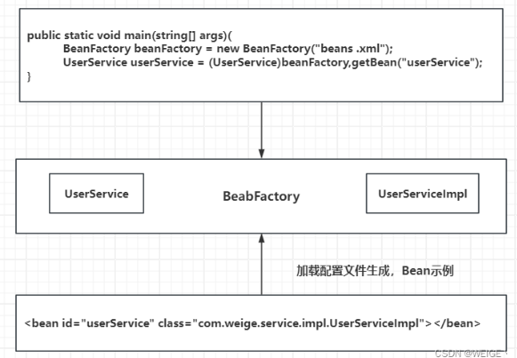
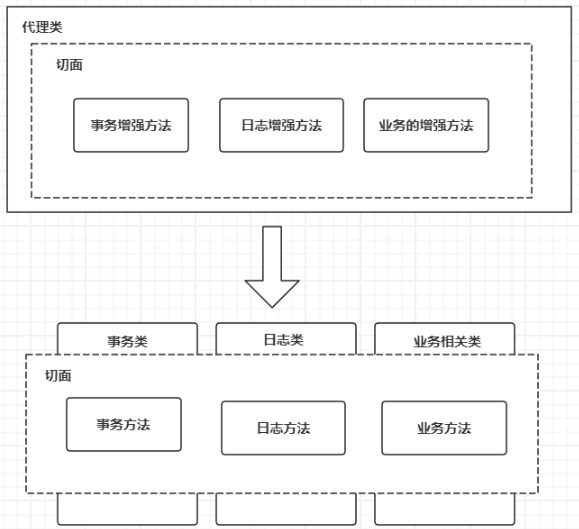

Spring 是一款主流的 Java EE 轻量级开源框架 ，其目的是用于简化 Java 企业级应用的开发难度和开发周期。Spring的用途不仅限于服务器端的开发。从简单性、可测试性和松耦合的角度而言，任何Java应用都可以从Spring中受益。

<!-- more -->

## 1.Spring是什么

- Spring 是一款主流的 Java EE 轻量级开源框架 ，其目的是用于简化 Java 企业级应用的开发难度和开发周期。Spring的用途不仅限于服务器端的开发。从简单性、可测试性和松耦合的角度而言，任何Java应用都可以从Spring中受益。Spring 提供了功能强大IOC、AOP及Web MVC等功能。Spring 框架除了自己提供功能外，还提供整合其他技术和框架的能力。是当前企业中Java开发几乎不能缺少的框架之一。
- 广义上的 Spring 泛指以 Spring Framework 为核心的 Spring 技术栈。Spring自2003年1.0版本发布以来，经过十多年的发展，Spring 已经不再是一个单纯的应用框架，而是逐渐发展成为一个由多个不同子项目（模块）组成的成熟技术，例如 Spring Framework、Spring MVC、SpringBoot、Spring Cloud、Spring Data、Spring Security 等。
- 狭义的 Spring 特指 Spring Framework，通常我们将它称为 Spring 框架，是一个分层的、面向切面的 Java 应用程序框架，其中最为核心模块： IoC 和 AOP。

## 2.Spring解决了什么问题

- Spring设计的初衷是为了降低企业级应用程序开发复杂性，它主要解决程序开发过程中的以下问题：

- 解决了传统Java程序代码的紧密耦合问题。传统的Java程序代码通常将对象的构建、接口的实现以及业务的实现紧密的耦合在一起，不利于代码的扩展性，若业务逻辑发生改变，将可能面临全局的修改。Spring提出了Ioc（Inversion of control：即控制反转）的设计计思想，将原本在程序中手动创建对象的控制权、对象之间的相互依赖关系交给 IoC 容器来管理，并由 IoC 容器完成对象的注入。这样即实现了对象之间的松耦合，使程序的的可读性和扩展性大大提升，又在可以很大程度上简化应用的开发。
- 解决了传统Java程序代码的样板代码冗余的问题。传统的Java程序代码中，需要在业务代码前后插入大量的日志代码、事务代码等一些冗余的样板式代码，导致代码可读性降低。Spring提出了AOP面向切面思想，根据要求为程序提供需要的Bean对象的代理对象，代理对象内部动态结合业务和通用功能，在代理对象中对目标对象方法进行相应的增强。

## 3.Spring特点

- 非侵入式：使用 Spring Framework 开发应用程序时，Spring 对应用程序本身的结构影响非常小。对领域模型可以做到零污染；对功能性组件也只需要使用几个简单的注解进行标记，完全不会破坏原有结构，反而能将组件结构进一步简化。这就使得基于 Spring Framework 开发应用程序时结构清晰、简洁优雅。
- 控制反转：IoC——Inversion of Control，翻转资源获取方向。把自己创建资源、向环境索取资源变成环境将资源准备好，我们享受资源注入。
- 面向切面编程：AOP——Aspect Oriented Programming，在不修改源代码的基础上增强代码功能。
- 容器：Spring IoC 是一个容器，因为它包含并且管理组件对象的生命周期。组件享受到了容器化的管理，替程序员屏蔽了组件创建过程中的大量细节，极大的降低了使用门槛，大幅度提高了开发效率。
- 组件化：Spring 实现了使用简单的组件配置组合成一个复杂的应用。在 Spring 中可以使用 XML 和 Java 注解组合这些对象。这使得我们可以基于一个个功能明确、边界清晰的组件有条不紊的搭建超大型复杂应用系统。
- 一站式：在 IoC 和 AOP 的基础上可以整合各种企业应用的开源框架和优秀的第三方类库。
  
## 4.Spring框架组成

Spring Core（核心容器）
 spring core提供了IOC,DI,Bean配置装载创建的核心实现。核心概念： Beans、BeanFactory、BeanDefinitions、ApplicationContext。

- spring-core ：IOC和DI的基本实现
  - spring-beans：BeanFactory和Bean的装配管理(BeanFactory)
  - spring-context：Spring context上下文，即IOC容器(AppliactionContext)
  - spring-expression：spring表达式语言
- Spring AOP
  - spring-aop：面向切面编程的应用模块，整合ASM，CGLib，JDK Proxy
  - spring-aspects：集成AspectJ，AOP应用框架
  - spring-instrument：动态Class Loading模块
- Spring Data Access
  - spring-jdbc：spring对JDBC的封装，用于简化jdbc操作
  - spring-orm：java对象与数据库数据的映射框架
  - spring-oxm：对象与xml文件的映射框架
  - spring-jms： Spring对Java Message Service(java消息服务)的封装，用于服务之间相互通信
  - spring-tx：spring jdbc事务管理
- Spring Web
  - spring-web：最基础的web支持，建立于spring-context之上，通过servlet或listener来初始化IOC容器
  - spring-webmvc：实现web mvc
  - spring-websocket：与前端的全双工通信协议
  - spring-webflux：Spring 5.0提供的，用于取代传统java servlet，非阻塞式Reactive Web框架，异步，非阻塞，事件驱动的服务
- Spring Message
  - spring-messaging：spring 4.0提供的，为Spring集成一些基础的报文传送服务
- Spring test
  - spring-test：集成测试支持，主要是对junit的封装
  
## 5.Spring核心原理

1. IoC思想和DI思想
   

  IoC思想：强调的是原来在程序中创建Bean的权利反转给第三方。 例如：原来在程序中手动的去 new UserServiceImpl()，手动的去new UserDaoImpl()，而根据IoC思想的指导， 寻求一个第三方去创建UserServiceImpl对象和UserDaoImpl对象。这样程序与具体对象就失去的直接联系。 Spring使用工厂设计模式，用BeanFactory来充当第三方的角色，来产生Bean实例 可以使用配置文件配置Bean的基本信息，BeanFactory根据配置文件来生产Bean实例

  上面使用BeanFactory的方式实现的"控制反转"，将Bean的创建权交给了BeanFactory，如果UserService内部还需要用到UserDao实例对象，我们通过BeanFactory获得UserService和UserDao，将UserDao设置给UserService。将UserDao在BeanFactory内部设置给UserService的过程叫做“注入”，而UserService需要依赖UserDao的注入才能正常工作，这个过程叫做依赖注入（DI）

2. AOP思想

AOP思想：面向切面编程，是对面向对象编程OOP的升华。OOP是纵向对一个事物的抽象，一个对象包括静态的属性信息，包括动态的方法信息等。而AOP是横向的对不同事物的抽象，属性与属性、方法与方法、对象与对象都可以组成一个切面。切面分散在每个各个模块中解决同一样的问题，如用户验证、日志管理、事务处理、数据缓存都属于切面关注点。从每个方法中抽取出来的同一类非核心业务。AOP通过预编译方式和运行期动态代理方式实现，在不修改源代码的情况下，给程序动态统一添加额外功能的一种技术。利用AOP可以对业务逻辑的各个部分进行隔离，从而使得业务逻辑各部分之间的耦合度降低，提高程序的可重用性，同时提高了开发的效率。

3. 综上所述其作用包括以下两点：

   - 简化代码：把方法中固定位置的重复的代码抽取出来，让被抽取的方法更专注于自己的核心功能，提高内聚性。
   - 代码增强：把特定的功能封装到切面类中，看哪里有需要，就往上套，被套用了切面逻辑的方法就被切面给增强了