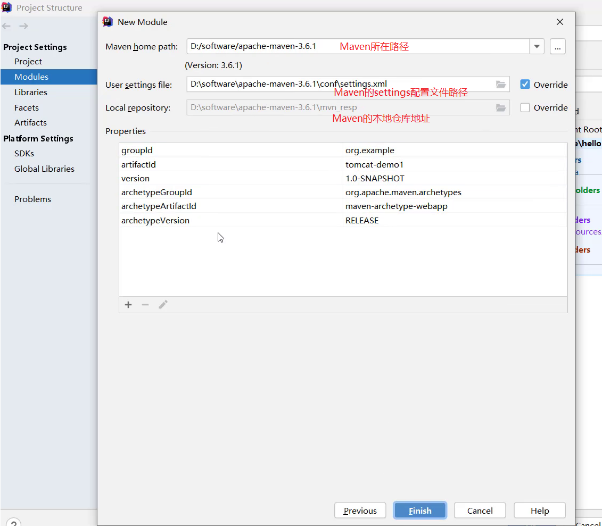
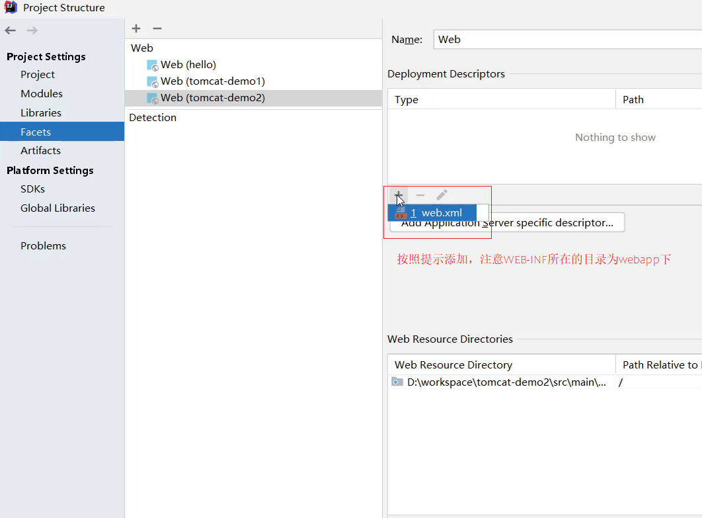
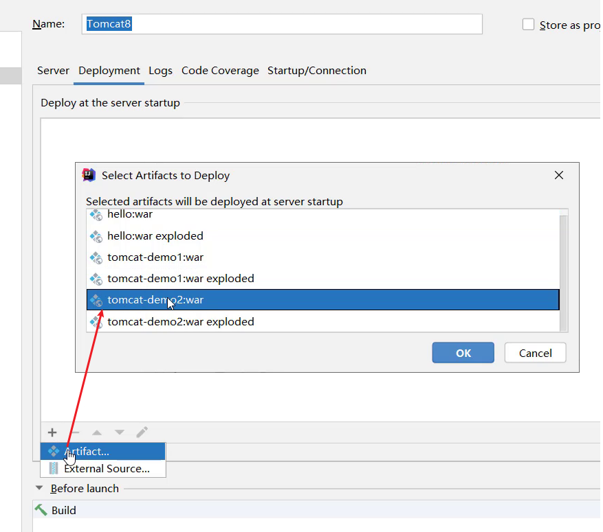
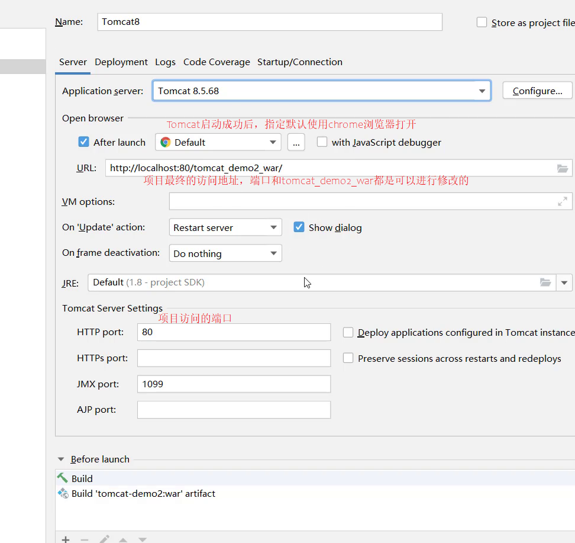

使用IDEA编辑器集成TomCat创建Maven的Web项目

<!-- more -->

## 1. Maven创建Web项目

###  1.1 Web项目结构

* Maven Web项目结构: 开发中的项目

  

* 开发完成部署的Web项目

  

  * 开发项目通过执行Maven打包命令**package**,可以获取到部署的Web项目目录
  * 编译后的Java字节码文件和resources的资源文件，会被放到WEB-INF下的classes目录下
  * pom.xml中依赖坐标对应的jar包，会被放入WEB-INF下的lib目录下

### 1.2 创建Maven Web项目

#### 1.2.1 使用骨架

> 具体的步骤包含:
>
> 1.创建Maven项目
>
> 2.选择使用Web项目骨架
>
> 3.输入Maven项目坐标创建项目
>
> 4.确认Maven相关的配置信息后，完成项目创建
>
> 5.删除pom.xml中多余内容
>
> 6.补齐Maven Web项目缺失的目录结构

1. 创建Maven项目

   

2. 选择使用Web项目骨架

   

3. 输入Maven项目坐标创建项目

   

4. 确认Maven相关的配置信息后，完成项目创建

   

5. 删除pom.xml中多余内容，只留下面的这些内容，注意打包方式 jar和war的区别

   

6. 补齐Maven Web项目缺失的目录结构，默认没有java和resources目录，需要手动完成创建补齐，最终的目录结果如下

   


#### 1.2.2 不使用骨架

>具体的步骤包含:
>
>1.创建Maven项目
>
>2.选择不使用Web项目骨架
>
>3.输入Maven项目坐标创建项目
>
>4.在pom.xml设置打包方式为war
>
>5.补齐Maven Web项目缺失webapp的目录结构
>
>6.补齐Maven Web项目缺失WEB-INF/web.xml的目录结构

1.  创建Maven项目

   

2.  选择不使用Web项目骨架

   

3.  输入Maven项目坐标创建项目

   

4.  在pom.xml设置打包方式为war,默认是不写代表打包方式为jar

   

5.  补齐Maven Web项目缺失webapp的目录结构

   

6.  补齐Maven Web项目缺失WEB-INF/web.xml的目录结构

   

7.  补充完后，最终的项目结构如下:

   

   

   

## 2.  IDEA集成Tomcat

* Maven Web项目创建成功后，通过Maven的package命令可以将项目打包成war包，将war文件拷贝到Tomcat的webapps目录下，启动Tomcat就可以将项目部署成功，然后通过浏览器进行访问即可。
* 然而我们在开发的过程中，项目中的内容会经常发生变化，如果按照上面这种方式来部署测试，是非常不方便的，因此可以在IDEA中集成使用Tomcat，集成方式分为两种：
  * 集成本地Tomcat
  * Tomcat Maven插件


### 2.1 集成本地Tomcat

1. 打开添加本地Tomcat的面板

   

2. 指定本地Tomcat的具体路径

   

3. 修改Tomcat的名称，此步骤可以不改，只是让名字看起来更有意义，HTTP port中的端口也可以进行修改，比如把8080改成80

   

4. 将开发项目部署项目到Tomcat中

   

   ::: info

   扩展内容： xxx.war和 xxx.war exploded这两种部署项目模式的区别?

   * war模式是将WEB工程打成war包，把war包发布到Tomcat服务器上
   * war exploded模式是将WEB工程以当前文件夹的位置关系发布到Tomcat服务器上
   * war模式部署成功后，Tomcat的webapps目录下会有部署的项目内容
   * war exploded模式部署成功后，Tomcat的webapps目录下没有，而使用的是项目的target目录下的内容进行部署
   * 建议大家都选war模式进行部署，更符合项目部署的实际情况

   :::

5. 部署成功后，就可以启动项目，为了能更好的看到启动的效果，可以在webapp目录下添加a.html页面

   

   > **最终的注意事项**

   

   

 ### 2.2 Tomcat Maven插件

在IDEA中使用本地Tomcat进行项目部署，相对来说步骤比较繁琐，所以我们需要一种更简便的方式来替换它，那就是直接使用Maven中的Tomcat插件来部署项目，具体的实现步骤，只需要两步，分别是:

1. 在pom.xml中添加Tomcat插件

   ```xml
   <build>
       <plugins>
       	<!--Tomcat插件 -->
           <plugin>
               <groupId>org.apache.tomcat.maven</groupId>
               <artifactId>tomcat7-maven-plugin</artifactId>
               <version>2.2</version>
           </plugin>
       </plugins>
   </build>
   ```

2. 使用Maven Helper插件快速启动项目，选中项目，右键-->Run Maven --> tomcat7:run


:::info

* 如果选中项目并右键点击后，看不到Run Maven和Debug Maven，这个时候就需要在IDEA中下载Maven Helper插件，具体的操作方式为: File --> Settings --> Plugins --> Maven Helper ---> Install,安装完后按照提示重启IDEA，就可以看到了。

* Maven Tomcat插件目前只有Tomcat7版本，没有更高的版本可以使用
* 使用Maven Tomcat插件，要想修改Tomcat的端口和访问路径，可以直接修改pom.xml

:::

```xml
<build>
    <plugins>
    	<!--Tomcat插件 -->
        <plugin>
            <groupId>org.apache.tomcat.maven</groupId>
            <artifactId>tomcat7-maven-plugin</artifactId>
            <version>2.2</version>
            <configuration>
            	<port>80</port><!--访问端口号 -->
                <!--项目访问路径
					未配置访问路径: http://localhost:80/tomcat-demo2/a.html
					配置/后访问路径: http://localhost:80/a.html
					如果配置成 /hello,访问路径会变成什么?
						答案: http://localhost:80/hello/a.html
				-->
                <path>/</path>
            </configuration>
        </plugin>
    </plugins>
</build>
```

